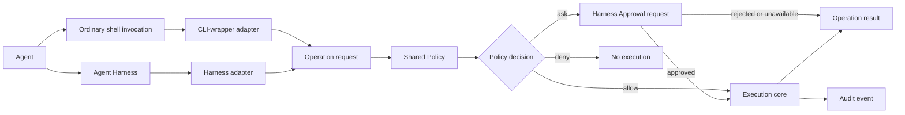

# Gaitcheck

Gaitcheck is a prototype for a universal agent tool translation layer.

The project asks one practical question:

> Can an agent run harmless commands without friction while making
> consequential commands visible and interruptible?

The first target is OpenCode. The first supported Operation is
`command.execute`, which represents a request to run a shell command.

## Current Concept

An agent Harness exposes tools to an agent. OpenCode exposes a `bash` tool, for
example. A different Harness may expose a tool with a different name and API.

Gaitcheck puts a thin Harness adapter between the Harness and one shared
Policy:



The shared Policy returns:

- `allow`: run without an Approval request.
- `ask`: show an Approval request in the active Harness.
- `deny`: do not run the Operation request.

When several rules match, the strongest decision wins:

```text
deny > ask > allow
```

This is a trust and visibility experiment. It is not a security boundary,
sandbox, credential isolation system, or guarantee that all other ways to run
commands have been removed.

## What Works Now

The repository contains:

- A shared Policy evaluator in `src/policy.ts`.
- 13 automated Policy tests in `src/policy.test.ts`.
- An OpenCode custom `bash` Harness adapter.
- Native OpenCode TUI Approval requests for commands that require review.
- Allow, ask, and deny behavior.
- Composed command evaluation.
- Working-directory and timeout handling in the OpenCode adapter.
- In-memory Audit events with correlation identities.

The current OpenCode adapter has been tested manually for:

- Safe commands without an Approval request.
- Unknown commands with Reject and Allow once.
- Shell pipelines with Reject and Allow once.
- Destructive Git commands blocked before execution.

## What Does Not Exist Yet

This is not a finished product. The following work remains open:

- A user-facing Policy configuration format with lists, patterns, and regular
  expressions.
- A shared normalized Execution contract across all Harness adapters.
- A universal Audit contract and persistent audit storage.
- A Claude Code Harness adapter.
- A CLI-wrapper Harness adapter prototype in `prototypes/cli-wrapper-translation/`.
- Complete shell parsing and native shell behavior parity.
- Credential, network, and operating-system isolation.

The user-facing Policy configuration is tracked in [issue #15](https://github.com/Jumace/gaitcheck/issues/15).

## Quick Start

### Run the Policy tests

From the repository root:

```bash
npm test
```

The project uses Node's built-in test runner. The test command uses Node's
TypeScript type stripping, so no root dependency installation is required for
the current tests.

### Run the OpenCode prototype

From the prototype directory:

```bash
cd prototypes/opencode-translation
npm install --prefix .opencode
opencode
```

The prototype loads its custom tool from:

```text
prototypes/opencode-translation/.opencode/tools/bash.ts
```

The OpenCode permission configuration is:

```text
prototypes/opencode-translation/opencode.jsonc
```

Restart OpenCode after changing this configuration.

Try a command that is explicitly allowed:

```text
Use the bash tool exactly once with command: printf 'hello\n'. Report the complete tool result.
```

Try an unknown command:

```text
Use the bash tool exactly once with command: echo readme-test. Report the complete tool result.
```

OpenCode should show an Approval request. Reject it first. Run the same request
again and select Allow once.

Read the [beginner's guide](docs/beginners-guide.md) for a complete manual
walkthrough.

## Repository Structure

```text
.
├── README.md
├── CONTEXT.md
├── package.json
├── src/
│   ├── policy.ts
│   └── policy.test.ts
├── docs/
│   ├── beginners-guide.md
│   ├── current-state.md
│   └── agents/
├── prototypes/
│   └── opencode-translation/
│       ├── README.md
│       ├── opencode.jsonc
│       └── .opencode/
│           ├── package.json
│           └── tools/bash.ts
├── article_material/
│   ├── README.md
│   ├── ARTICLE_NOTES.md
│   ├── PROJECT_PLAN.md
│   └── research/
│       ├── opencode-controlled-profile.md
│       ├── opencode-elicitation.md
│       └── runtime-and-mcp-sdk.md
├── DEVELOPMENT_LOG.md
├── AGENTS.md
└── CLAUDE.md
```

### Root files

- `README.md`: project introduction, quick start, and file structure.
- `CONTEXT.md`: shared domain language and terms.
- `package.json`: root test command.
- `DEVELOPMENT_LOG.md`: design history, including superseded approaches.
- `AGENTS.md`: instructions for coding agents working in this repository.
- `CLAUDE.md`: Claude entry point for the repository instructions.
- `article_material/`: historical project plans, research, and article source
  material. Read its README before treating older proposals as current design.

### Shared implementation

- `src/policy.ts`: Operation request types, Policy rule types, command parsing,
  Policy evaluation, decision precedence, and evaluation results.
- `src/policy.test.ts`: behavior tests at the `evaluatePolicy` public seam.

### Documentation

- `docs/beginners-guide.md`: plain-language explanation and manual tutorial.
- `docs/current-state.md`: detailed engineering status, behavior, limitations,
  verification, and issue state.
- `docs/agents/`: instructions for agents working with this repository.

### OpenCode prototype

- `prototypes/opencode-translation/.opencode/tools/bash.ts`: OpenCode Harness
  adapter and prototype Execution core.
- `prototypes/opencode-translation/opencode.jsonc`: granular OpenCode
  permissions needed for TUI approval behavior.
- `prototypes/opencode-translation/README.md`: prototype-specific instructions
  and findings.

### Historical research

- `article_material/research/`: external capability research for OpenCode, MCP,
  and related targets.

## Important Limitation

The OpenCode custom tool runs commands with the operating-system privileges of
the user who starts OpenCode. The tool can be bypassed by changing the
OpenCode configuration, enabling another tool or plugin, using another MCP
server, or running a separate process.

The project therefore measures visibility and approval behavior. It does not
claim to enforce a complete security policy against a determined attacker.

## More Documentation

- [Beginner's Guide](docs/beginners-guide.md)
- [Current Development State](docs/current-state.md)
- [OpenCode Prototype Notes](prototypes/opencode-translation/README.md)
- [Project Context](CONTEXT.md)
- [Development Log](DEVELOPMENT_LOG.md)
- [Article Material](article_material/README.md)
