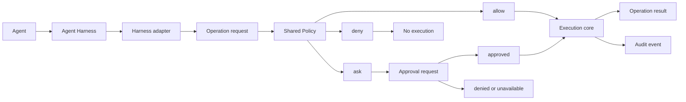
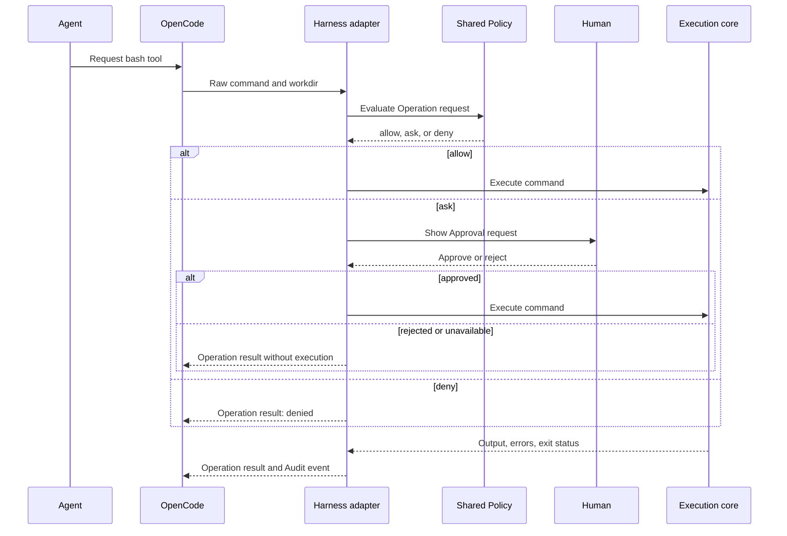

# Beginner's Guide

## What Is This Project?

Gaitcheck is an experiment for making coding agents easier to trust.

A coding agent can run commands on your computer. Some commands only read
information:

```bash
git status
git diff
printf 'hello\n'
```

Other commands can change important things:

```bash
git commit
git push
terraform apply
git reset --hard HEAD
```

The problem is not that every command is dangerous. The problem is that an
agent can move from a small request to a larger action without making that
change obvious.

Gaitcheck tests this approach:

- Let known safe commands run normally.
- Ask the human before consequential commands.
- Block commands that the Policy marks as destructive.
- Explain the decision.
- Record enough information to understand what happened.

This is a trust and visibility experiment. It is not a security boundary or a
complete computer sandbox.

## The Three Decisions

Every command receives one Policy decision.

### Allow

The command matches a safe Policy rule. It runs without an Approval request.

```text
Raw command: git status
Policy decision: allow
Result: command runs without a prompt
```

### Ask

The command may change something important, or the Policy does not understand
it well enough. The Harness adapter shows an Approval request.

```text
Raw command: git push origin feature/example
Policy decision: ask
Approval request: shown in the OpenCode TUI
Human choice: Allow once, Allow for session, or Reject
```

An unknown command also uses `ask`:

```text
Raw command: echo hello
Policy decision: ask
Reason: no Policy rule matches the command
```

### Deny

The Policy identifies a command as destructive or disallowed. No Approval
request is created, and the Execution core does not run the command.

```text
Raw command: git reset --hard HEAD
Policy decision: deny
Result: command is blocked before execution
```

### Decision precedence

If more than one rule matches, the strongest decision wins:

```text
deny > ask > allow
```

For example, a broad rule may allow all Git commands, while a specific rule
denies `git reset --hard`. The final decision is `deny`.

## The Main Idea in One Diagram



## Important Project Terms

### Operation request

An Operation request is the common form of an action that an agent wants to
perform.

The first supported Operation is:

```text
command.execute
```

Example:

```text
operation: command.execute
raw command: git status
working directory: /home/eule/code/gaitcheck
```

`command.execute` is not a shell command. It is the shared name for the type
of action.

### Raw command

The Raw command is the exact command text received from the Harness.

Example:

```text
git status --short
```

The Raw command remains available for display and audit. It is not replaced by
an interpretation made by the parser.

### Parsed command metadata

Parsed command metadata is optional information derived from the Raw command:

```text
executable: git
arguments: ["status", "--short"]
shell mode: simple
```

The Policy can use this metadata for matching. If the metadata conflicts with
the Raw command, the Policy returns `ask` instead of trusting the metadata.

### Policy

The Policy evaluates an Operation request and returns `allow`, `ask`, or
`deny`.

The first internal Policy rules support:

- Exact matching.
- Prefix matching.
- Optional exact working-directory matching.
- A stable rule identifier.
- A human-readable explanation.

The later user-facing configuration is expected to support lists, patterns,
and regular expressions. That work is tracked in [issue #15](https://github.com/Jumace/gaitcheck/issues/15).

### Harness adapter

A Harness is the application that runs the agent. OpenCode is the first
Harness used in this project.

A Harness adapter connects the shared Policy to one Harness. It translates a
Harness-specific tool call into an Operation request and translates the result
back into the Harness format.

The goal is to keep the Policy the same when the Harness changes.

### Approval request

When the Policy returns `ask`, the Harness adapter creates an Approval request.
It should show:

- The exact command.
- The working directory.
- The matched Policy rule.
- The reason for the request.

OpenCode shows this request in its TUI.

### Approval outcome

An Approval outcome describes what happened after the human interaction:

```text
status: approved | denied | cancelled | unavailable
scope: once | session
```

`once` is the default scope. `session` must be selected explicitly when the
Harness supports it.

The current OpenCode plugin API does not expose enough information to
distinguish every outcome. The adapter documents this limitation instead of
pretending that it knows more than the API reports.

### Execution core

The Execution core runs an approved command and collects its result.

The current OpenCode prototype starts:

```text
bash -lc <raw command>
```

It captures output, errors, exit status, and timeout state.

### Audit event

An Audit event records what happened to an Operation request. The current event
contains information such as:

```text
raw command
working directory
Policy decision
matched rule
explanation
approval status
exit status
timeout state
correlation identity
```

The current prototype stores Audit events in memory. It does not write a
permanent audit log.

## The Process Flow



## Composed Commands

A shell command can contain several command parts:

```bash
git status && printf 'done\n'
```

The shared Policy treats this as one parent Operation request with derived
parts:

```text
printf     -> allow
final      -> allow
```

If one part needs approval, the parent result is `ask`. If one part is denied,
the parent result is `deny`.

```text

git status -> allow
final      -> ask
```

```text
printf safe; git reset --hard HEAD

printf safe          -> allow
final                -> deny
```

The Policy returns `ask` when it cannot understand shell behavior safely. The
current uncertain cases include command substitution, backticks, redirection,
unclosed quotes, and dynamic command values.

The OpenCode configuration is more conservative than the shared evaluator. It
asks for shell composition even when every parsed part is currently allowed.

## How OpenCode Works Today

The OpenCode prototype replaces the built-in `bash` tool with this local custom
tool:

```text
prototypes/opencode-translation/.opencode/tools/bash.ts
```

The tool keeps the name `bash`, so the agent does not need a new command
vocabulary. It calls the shared Policy evaluator before it starts a process.

The OpenCode configuration is:

```text
prototypes/opencode-translation/opencode.jsonc
```

The configuration must not set the outer `bash` permission to global `allow`.
That would silently approve every custom-tool request before
`context.ask()` reaches the TUI. The prototype uses granular rules with a
default `ask`.

## Try It Yourself

### 1. Start the prototype

From the repository root:

```bash
cd /home/eule/code/gaitcheck/prototypes/opencode-translation
npm install --prefix .opencode
opencode
```

Restart OpenCode after configuration changes.

### 2. Test an allowed command

Enter this request in OpenCode:

```text
Use the bash tool exactly once with command: printf 'hello\n'. Report the complete tool result.
```

Expected result:

```text
hello
```

There should be no Approval request.

### 3. Test an unknown command

Enter:

```text
Use the bash tool exactly once with command: echo beginner-test. Report the complete tool result.
```

Expected result:

- OpenCode shows an Approval request.
- Select Reject.
- The command does not print `beginner-test`.

Run the same request again and select Allow once. It should then print:

```text
beginner-test
```

### 4. Test a composed command

Enter:

```text
Use the bash tool exactly once with command: printf 'left\nright\n' | wc -l. Report the complete tool result.
```

Expected result:

- OpenCode shows an Approval request because the local OpenCode configuration
  asks for shell composition.
- Select Allow once.
- The command prints:

```text
2
```

### 5. Test a harmless deny case

Enter:

```text
Use the bash tool exactly once with command: git clean -f --dry-run. Report the complete tool result.
```

Expected result:

```text
Unable to run git clean -f --dry-run: it was blocked as a potentially destructive Git operation.
```

No approval request should appear. The `--dry-run` flag makes this safe even if
the Policy configuration is accidentally changed.

### 6. Run the automated tests

In a second terminal:

```bash
cd /home/eule/code/gaitcheck
npm test
```

The current suite contains 13 tests.

## What It Can Do

The current prototype can:

- Classify known commands as `allow`, `ask`, or `deny`.
- Ask for approval inside the OpenCode TUI.
- Keep safe commands free of approval requests.
- Reject an unknown command.
- Block destructive Git commands.
- Evaluate command parts in a composed command.
- Capture command output and exit status.
- Apply a timeout.
- Apply an explicit working directory.
- Produce an in-memory Audit event.
- Preserve a correlation identity for an Operation request.

## What It Cannot Do

The current prototype cannot:

- Stop a determined process from bypassing the adapter.
- Sandbox the operating system.
- Protect credentials from the process environment.
- Isolate network access.
- Fully parse every shell feature.
- Reproduce every native OpenCode shell behavior.
- Store Audit events permanently.
- Provide the final user-friendly Policy configuration format.
- Act as a Claude Code adapter or CLI wrapper.

The prototype runs with the same operating-system privileges as the user who
starts OpenCode. A user can change the OpenCode configuration, install another
plugin, enable another tool, or run a separate process. This is why the
project describes the current work as a trust and visibility experiment.

## What Comes Next

The next major work is to define the shared normalized Execution contract and
the universal Audit contract. These will allow OpenCode, Claude Code, MCP, and
CLI-wrapper adapters to use the same result and Audit vocabulary.

The later user-facing Policy configuration is tracked in:

[Issue #15: Design user-facing Policy configuration](https://github.com/Jumace/gaitcheck/issues/15)

That future format is expected to support lists, patterns, and regular
expressions. The current evaluator deliberately uses only exact and prefix
matching.
