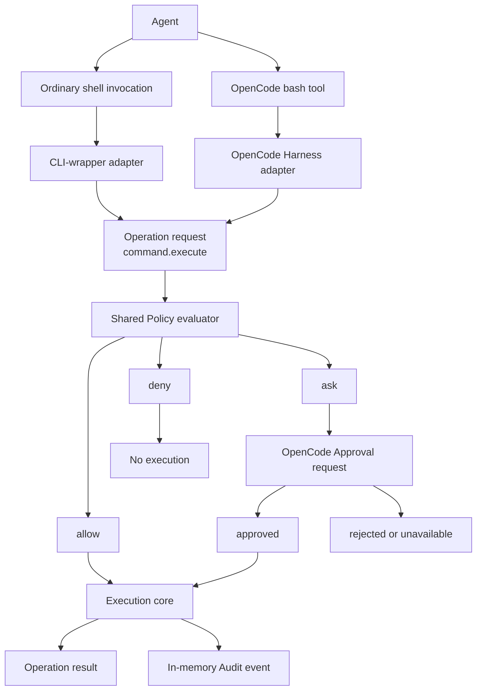
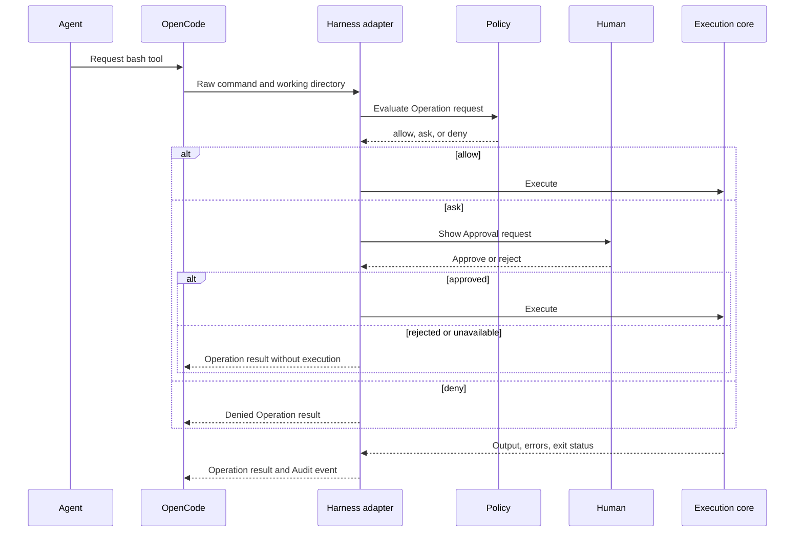

# Current Development State

Updated: 2026-09-06

## Purpose

Gaitcheck is a prototype for a universal agent tool translation layer.

The project explores whether an agent can become easier to trust when
consequential actions are visible and interruptible without requiring approval
for every harmless action.

This is a trust and visibility experiment. It is not a security boundary, a
sandbox, an antivirus system, or a guarantee that an agent cannot act outside
the configured path.

## Current Position

The project has a working shared Policy evaluator and a working OpenCode
Harness adapter.

The current path is:



The Adapter translates Harness-specific input. The Policy makes the shared
decision. The Execution core runs an approved command and creates the
Operation result and Audit event.

The high-level runtime flow is:



The implementation currently lives on the local branch
`prototype/opencode-translation`.

Latest commits:

- `e265b1e` - implement shared policy evaluator
- `3fc92cd` - harden policy adapter integration
- `d34bc06` - propagate policy correlation identity

The branch has not been published as a package or pushed as a public install
target.

## What Works

### Shared Policy evaluator

The evaluator is in `src/policy.ts`.

Its public entry point is:

```ts
evaluatePolicy(operationRequest, policy)
```

The first supported Operation is:

```text
command.execute
```

An Operation request contains:

```ts
{
  operation: "command.execute",
  rawCommand: "git status",
  workingDirectory: "/home/user/project",
  parsedCommandMetadata?: {
    executable: "git",
    arguments: ["status"],
    shellMode: "simple"
  },
  correlationId?: "..."
}
```

The Policy returns a Policy evaluation with one of these Policy decisions:

```text
allow
ask
deny
```

The evaluator supports:

- Exact executable and argument matching.
- Prefix executable and argument matching.
- Optional exact working-directory matching.
- Stable Policy rule identifiers.
- Human-readable Policy explanations.
- Unknown commands returning `ask`.
- Uncertain parsing returning `ask`.
- Invalid Policy configuration returning an unavailable Policy evaluation.
- Decision precedence of `deny > ask > allow`.
- Composed shell commands evaluated as derived parts under one parent
  Operation request.
- Raw command and Parsed command metadata conflict detection.
- Correlation identity propagation.

The evaluator does not inspect environment variable values. The Execution core
may still inherit the process environment when it runs a command.

### Composed commands

The shared Policy evaluator does not automatically ask for every composed
command.

For a known command such as:

```bash
git status && printf 'done\n'
```

the evaluator creates command parts, evaluates each part, and combines the
results:

```text
git status  -> allow
printf      -> allow
final       -> allow
```

If one part needs approval, the parent result is `ask`. If one part is denied,
the parent result is `deny`.

The OpenCode configuration is more conservative. Its outer permission rules
ask for shell composition even when the shared Policy can classify all parts.
This avoids silently allowing a shell construct while the prototype parser is
still deliberately small.

The parser asks when it cannot classify shell behavior safely. Current
uncertain cases include:

- Command substitution such as `$(...)`.
- Backtick command substitution.
- Input or output redirection.
- Unclosed quotes.
- A trailing escape character.
- Dynamic values that cannot be classified confidently.

### OpenCode adapter

The adapter is:

```text
prototypes/opencode-translation/.opencode/tools/bash.ts
```

It replaces OpenCode's built-in `bash` tool with a custom tool that keeps the
same tool name and basic argument shape:

```text
command
workdir?
timeout?
```

The adapter has a prototype Policy configuration containing rules for:

- Read-only commands such as `git status`, `git diff`, `git log`, `pwd`, `ls`,
  `printf`, `node --version`, and `npm test` -> `allow`.
- Consequential commands such as `git commit`, `git push`, pull request
  creation, Terraform apply/destroy, and Kubernetes apply/delete -> `ask`.
- `git reset --hard` and `git clean` -> `deny`.
- Unmatched commands -> `ask`.

Approved commands execute with:

```text
bash -lc <raw command>
```

The adapter captures standard output, standard error, exit status, timeout
state, Policy decision, explanation, matched rule, and a correlation identity.
Audit events are currently kept in memory for the active process.

### Approval behavior

The OpenCode adapter uses the custom tool context's `context.ask()` method.
The active OpenCode TUI has been manually verified to:

- Run safe commands without an Approval request.
- Show an Approval request for an unknown command.
- Stop execution when the user selects Reject.
- Execute the command when the user selects Allow once.
- Show an Approval request for a shell pipeline.
- Block destructive Git operations without executing them.

The adapter keeps approval scope available in the shared types as `once` or
`session`, with `once` as the default. The current OpenCode plugin API returns
`Promise<void>` from `context.ask()` and does not expose the selected scope or
distinguish user rejection from an unavailable approval surface. The adapter
records a successful request as `approved` and a failed request as
`unavailable` rather than claiming information that OpenCode does not provide.

## Verification

Run the shared tests from the repository root:

```bash
npm test
```

Current result: 13 tests pass.

The tests cover:

- Simple allow.
- Unknown command ask.
- Destructive deny.
- Rule precedence.
- Allowed composed commands.
- Composed commands containing ask.
- Composed commands containing deny.
- Uncertain shell structure.
- Raw command and metadata conflict.
- Working-directory conditions.
- Invalid Policy configuration.
- Approval scope separation.
- Correlation identity propagation.

OpenCode smoke checks have also verified shared Policy allow, ask, and deny
behavior. The interactive TUI checks were completed manually in issue 14.

## Installation and Manual Test

This is not an installable package yet.

From the current checkout:

```bash
cd /home/eule/code/gaitcheck/prototypes/opencode-translation
npm install --prefix .opencode
opencode
```

The local OpenCode configuration is:

```text
prototypes/opencode-translation/opencode.jsonc
```

Restart OpenCode after configuration changes. The configuration must not set
the outer `bash` permission to global `allow`; that would silently approve the
custom tool's `context.ask()` calls.

Useful safe checks inside the OpenCode session:

```text
Use the bash tool exactly once with command: printf 'allow-test\n'. Report the complete tool result.
```

Expected: output without an Approval request.

```text
Use the bash tool exactly once with command: echo ask-test. Report the complete tool result.
```

Expected: an Approval request. Reject it first, then repeat and choose Allow
once.

```text
Use the bash tool exactly once with command: printf 'left\nright\n' | wc -l. Report the complete tool result.
```

Expected: an Approval request. Allow once to produce `2`.

For a harmless deny check:

```text
Use the bash tool exactly once with command: git clean -f --dry-run. Report the complete tool result.
```

Expected: OpenCode blocks it as a potentially destructive Git operation. The
`--dry-run` flag prevents deletion if a configuration mistake occurs.

## Files

| Path | Role |
| --- | --- |
| `src/policy.ts` | Shared Policy types, parser, evaluator, and result model |
| `src/policy.test.ts` | Shared Policy behavior tests |
| `package.json` | Root test command using Node's built-in test runner |
| `CONTEXT.md` | Project vocabulary and domain terms |
| `prototypes/opencode-translation/.opencode/tools/bash.ts` | OpenCode Harness adapter and prototype Execution core |
| `prototypes/opencode-translation/opencode.jsonc` | OpenCode permission configuration |
| `prototypes/opencode-translation/README.md` | OpenCode prototype run notes and findings |
| `docs/current-state.md` | This engineering state document |
| `docs/beginners-guide.md` | Beginner-friendly explanation and tutorial |

## Known Limits

The prototype does not provide:

- A security boundary.
- A sandbox or container.
- Credential isolation.
- Network isolation.
- Complete shell parsing.
- Complete native OpenCode shell parity.
- Persistent audit storage.
- A user-facing Policy configuration format.
- A Claude Code adapter.
- A production CLI-wrapper adapter. The issue 13 prototype is documented below.
- A normalized Execution contract implementation for all Harness adapters.
- A universal Audit contract implementation.
- A reliable distinction between OpenCode user rejection and unavailable
  approval UI.

The custom OpenCode tool can also be bypassed by changing OpenCode
configuration, enabling another unrestricted tool, installing a plugin, or
using a different process with the same operating-system account.

### CLI-wrapper target prototype

The throwaway PATH adapter is in `prototypes/cli-wrapper-translation/`. It
translates the shared Policy evaluator into wrappers for `git`, `gh`,
`terraform`, and `kubectl`, asks in the wrapper terminal, forwards allowed
argv directly to the real executable, denies destructive commands, and emits
JSONL-shaped audit events. It confirms that wrappers can provide broad
compatibility and useful visibility, but approval is outside the active
Harness and has no session scope. Shell composition, absolute executable
paths, equivalent commands, and direct APIs bypass the adapter. The target is
therefore a compatibility and visibility fallback, not an enforcement
boundary or an approval-parity target.

## Issue State

Completed decisions and prototypes:

- [#7 Define the canonical policy model](https://github.com/Jumace/gaitcheck/issues/7)
- [#10 Prototype the OpenCode translation target](https://github.com/Jumace/gaitcheck/issues/10)
- [#14 Validate OpenCode interactive approval and shell parity](https://github.com/Jumace/gaitcheck/issues/14)

Future configuration work:

- [#15 Design user-facing Policy configuration](https://github.com/Jumace/gaitcheck/issues/15)

Other open foundation or adapter work includes the normalized Execution
contract, the Audit contract, Claude Code, and CLI-wrapper targets. The
Wayfinder map is [issue #1](https://github.com/Jumace/gaitcheck/issues/1).

## Next Engineering Work

The next useful implementation work is to define the normalized Execution
contract and the universal Audit contract. Those contracts should use the
Policy evaluator without making OpenCode-specific assumptions.

The next harness comparison is the Claude Code Harness adapter. It should test
the same allow, ask, and deny Operation requests and report its Adapter
capabilities honestly.
